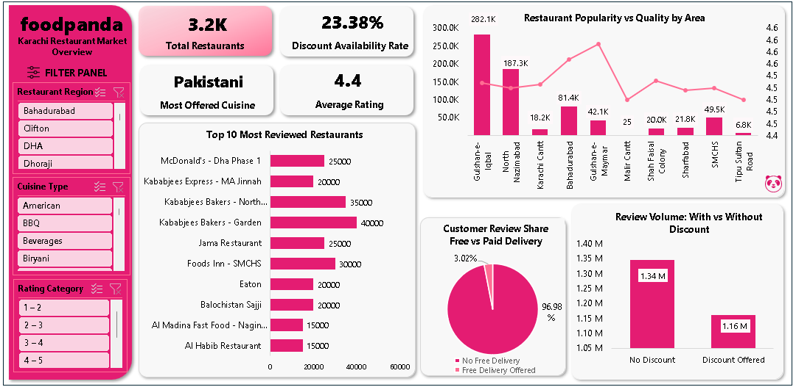
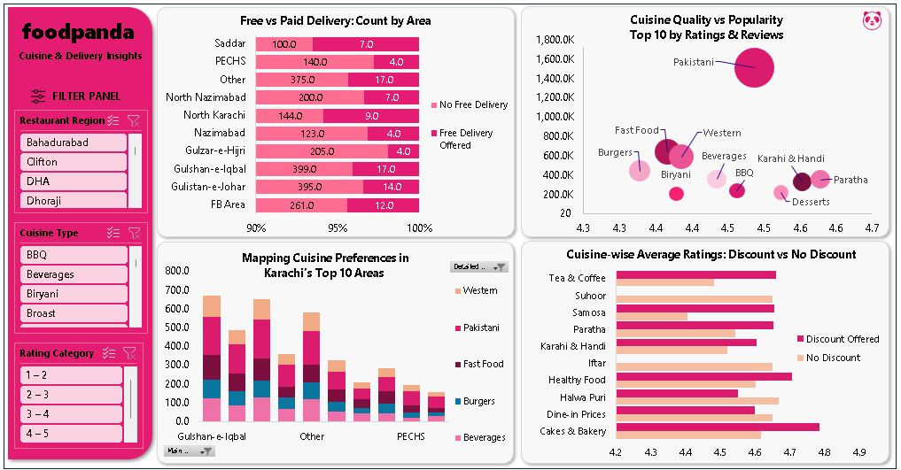

<h1 align="center">
  
   
  Foodpanda Karachi Restaurant Analysis & Insights
</h1>

  Extract → Clean → Analyze → Visualize   
  Restaurant Performance Insights For Karachi Using Python & Excel 

> This project delivers comprehensive insights into Karachi’s Foodpanda restaurant landscape through data extraction, cleaning, and analysis. Using Python for web
> scraping and Excel for advanced cleaning, KPI calculations, pivot tables, and dashboards, the analysis uncovers key patterns in cuisine popularity, ratings distribution,
> and delivery performance, empowering data-driven decision-making for the food delivery sector.

## 🔍 Data Analysis Journey  
*(From Web to Insights)*  

### 📊 Step 1: Data Extraction  

**Libraries Used:**  `selenium` ·  `beautifulsoup4` ·  `pandas` ·  `undetected_chromedriver` ·  `tqdm` ·  `json`  

**Process Overview:**  
1️⃣ **Initial Scraping:**  
   - Collected **basic restaurant info** from Foodpanda Karachi:  
     🍽️ Restaurant Name  
     ⭐ Rating  
     💸 Discount Details  
     🖼️ Image URL  
     🔗 Restaurant Page Link  
     🍛 Basic Cuisine Type  

2️⃣ **Detailed Scraping:**  
   - From each **Restaurant Page Link**, fetched:  
     🍲 Detailed Cuisine Description  
     📍 Area / Location  

3️⃣ **Data Storage:**  
   - Saved both datasets (**basic** & **detailed**) into **CSV files** 📄  
   - Converted to **Excel Workbook (.xlsx)** 📊 for further cleaning & analysis  

**Scripts Used:**  
📂 `main.py` → Runs main scraping process  
📂 `extract_and_save.py` → Saves scraped data into CSV  
📂 `scrape_details.py` → Fetches detailed info from individual restaurant pages  

---

### 📊 Step 2: Data Cleaning & Transformation

The raw dataset was cleaned and transformed using **Power Query Editor** and **Excel** to ensure accuracy, consistency, and readiness for analysis.

 🔹 **Key Cleaning Actions:**

- **Removed Duplicate Records** — Eliminated duplicate restaurant names using the link column as a unique identifier.  
- **Extracted Ratings & Review Counts** — Split the rating column into:  
  - `Rating Value`  
  - `Review Count`  
  - **Rating Category**:  
    - Low (1–2)  
    - Average (3–4)  
    - High (4–5) — created via Excel formulas.  
- **Simplified Discounts & Delivery Information** — Created new binary fields:  
  - `Has Discount` (Yes/No)  
  - `Free Delivery` (Yes/No)  
- **Removed Unnecessary Columns** — Dropped `Image URL` and `Cuisine` columns to streamline the dataset.  
- **Standardized Area Names** — Cleaned full addresses and grouped them into broader Karachi regions, fixing spelling inconsistencies using a custom column.  
- **Refined Cuisine Details** — Split combined cuisine lists into separate columns using delimiters for more granular analysis.
- **Handled Missing Data** — Replaced or removed `NULL` values where appropriate.  
- **Ensured Correct Data Types & Formatting** — Applied proper numeric, date, and text formats for consistency across columns.

---

### 📊 Step 3: Data Analysis & Visualizations

The cleaned dataset was imported into **Microsoft Excel** to perform detailed analysis and create interactive dashboards. This step leveraged Excel’s powerful **Pivot Tables**, **Calculated Measures**, **Slicers**, and **Charts** to extract meaningful insights about Foodpanda restaurants in Karachi.

#### ⚙️ Tools & Techniques Used
- Excel Power Query & Pivot Tables for dynamic data summarization  
- Calculated Measures created using Excel formulas  
- Slicers for interactive filtering by Restaurant Region, Cuisine Type, and Rating Category  
- Multiple chart types for clear and engaging visualization  

#### 📈 Key Calculated Measures
1. **Total Restaurants:** Count of unique restaurants in the dataset  
2. **Average Rating:** Weighted average rating based on review counts  
3. **Most Offered Cuisine:** Cuisine type appearing most frequently  
4. **Discount Availability Rate:** Percentage of restaurants offering discounts  

#### 🖥️ Dashboard 1: Market Overview

  
*Figure 1: Market Overview Dashboard showing KPIs and key charts*

- **Interactive KPIs:** Showcased the four main calculated measures  
- **Slicers:**  
  - Restaurant Region  
  - Cuisine Type  
  - Rating Category  
- **Charts included:**  
  - Clustered Bar Chart: Top 10 Most Reviewed Restaurants  
  - Combo Chart: Restaurant Popularity vs Quality by Area  
  - Pie Chart: Customer Review Share: Free vs Paid Delivery  
  - Clustered Column Chart: Review Volume: With vs Without Discount  

#### 🖥️ Dashboard 2: Cuisine & Delivery Insights

  
*Figure 2: Cuisine & Delivery Insights dashboard showcasing cuisine distribution, delivery types, and rating comparisons.*

- Same slicers for consistent filtering experience  
- **Charts included:**  
  - 100% Stacked Bar Chart: Free vs Paid Delivery Count by Area  
  - Stacked Column Chart: Mapping Cuisine Preferences in Karachi’s Top 10 Areas  
  - Clustered Bar Chart: Cuisine-wise Average Ratings (Discount vs No Discount)  
  - Bubble Chart: Cuisine Quality vs Popularity (Top 10 by Ratings & Reviews)  

*Note:* Since Pivot Tables do not support bubble charts directly, a helper table was created to enable this visualization  

#### 🔧 Additional Notes
- Data loaded dynamically into Excel to enable real-time dashboard updates  
- Extensive use of Excel formulas and conditional formatting to enhance dashboard clarity  
- The dashboards provide multi-dimensional insights into restaurant performance, cuisine popularity, customer review patterns, and delivery trends across Karachi’s regions  

This step completes the transition from raw data to actionable insights, enabling data-driven decisions for stakeholders in Karachi’s food delivery ecosystem.

## 💡 Key Findings & Insights

This section summarizes the most important insights extracted from the analysis of Karachi’s Foodpanda restaurant data. The findings highlight customer behavior, restaurant performance, cuisine popularity, and delivery trends to guide stakeholders in data-driven decision-making.

#### 🔑 Overall KPIs  
- **Total Restaurants:** 3,200+ unique outlets operating in Karachi’s Foodpanda network  
- **Average Rating:** High customer satisfaction with an average rating of **4.4 / 5**  
- **Most Offered Cuisine:** **Pakistani cuisine** dominates with highest presence (over 1,200 restaurants)  
- **Discount Availability Rate:** Approximately **23%** of restaurants offer discounts  

#### 🍽️ Customer Review Insights  
- Total of **2.51 million reviews** analyzed across all restaurants  
- Review volume is almost evenly split:  
  - **1.34 million** reviews from orders **without discount**  
  - **1.16 million** reviews from orders **with discount** — indicating strong engagement even without promotions  
- **Free Delivery** options are rare, constituting only **3%** of total reviews; vast majority (**97%**) of orders paid for delivery  

#### 📍 Regional Performance: Popularity & Quality  
- **Gulshan-e-Iqbal** leads with the highest review count (~282K) and a strong average rating of 4.5  
- Other top-performing areas maintaining high quality (avg rating 4.5–4.6) include:  
  - North Nazimabad, Bahadurabad, Gulshan-e-Maymar, Karachi Cantt, SMCHS  
- Smaller areas also show consistent high ratings, reflecting widespread customer satisfaction across Karachi  

#### 🍛 Top 10 Most Reviewed Restaurants  
- Leading restaurants with highest review counts (up to 40K reviews) include:  
  - Kababjees Bakers (Garden & North Nazimabad)  
  - Foods Inn (SMCHS)  
  - McDonald’s (DHA Phase 1)  
  - Balochistan Sajji, Eaton, Jama Restaurant, Al Habib, Al Madina Fast Food  
- These restaurants have established strong brand presence and loyal customer bases  

#### 🚚 Delivery Insights by Area  
- Majority of areas show **free delivery offered in less than 5%** of restaurants, confirming low penetration of free delivery offers  
- Areas like **Gulshan-e-Iqbal** and **Gulistan-e-Johar** have marginally higher free delivery offerings, potentially indicating competitive delivery strategies  

#### 🍲 Cuisine Popularity & Quality  
- **Pakistani cuisine** leads with over **1.5 million reviews** and a high average rating of **4.5**  
- Other popular cuisines with strong customer ratings:  
  - Fast Food (647K reviews, 4.4 avg)  
  - Burgers (448K, 4.3)  
  - Karahi & Handi (332K, 4.6)  
  - Paratha (360K, 4.6)  
- The bubble chart analysis reveals cuisines like **Karahi & Handi** and **Paratha** score highest for both quality and popularity, making them standout categories  

#### 🏙️ Area-wise Cuisine Distribution  
- Gulshan-e-Iqbal, Gulistan-e-Johar, and FB Area have the highest concentration of restaurants across top cuisines (Pakistani, Fast Food, Beverages, Burgers, Western)  
- Emerging areas such as North Nazimabad and Nazimabad have notable presence but relatively fewer outlets  

#### 🎯 Discount Impact on Ratings  
- Average ratings tend to be slightly higher for restaurants offering discounts (**4.7**) compared to those without (**4.5**)  
- This trend holds true across multiple cuisines such as Cakes & Bakery, Paratha, and Samosa — discounts may positively influence customer perception and engagement  

## 🔎 Summary

The analysis indicates Karachi’s Foodpanda market is robust and diverse, with Pakistani cuisine dominating in both quantity and quality. Customer satisfaction is generally high across regions and cuisines, though delivery incentives like free delivery remain underutilized. Discounts appear to boost ratings marginally, suggesting promotional strategies could be further optimized.

These insights provide valuable guidance for restaurant owners, delivery services, and marketers to refine offerings, improve customer engagement, and strategically expand within Karachi’s vibrant food delivery ecosystem.
